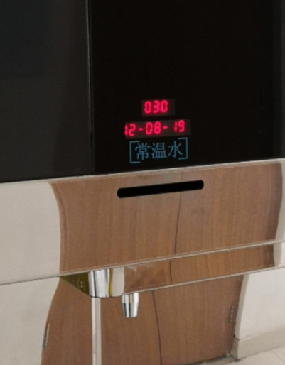

## WATER

* 换水的时候使用宿舍直饮水里面的**常温水**，不在宿舍的话可以用矿泉水，**但是一定不要用自来水！**
    
* 斗鱼杯中的水不要加太满，斗鱼会有跳缸现象，不注意的话会干死的
* 换水的周期一般是**2-3**天一换。具体时间可以根据自己的情况，如果水明显浑浊的话就需要立即换水
* 换水的时候注意小鱼会跳，所以尽量原理桌子边缘
* 每次换水的时候最好把杯子和水草清洗一下